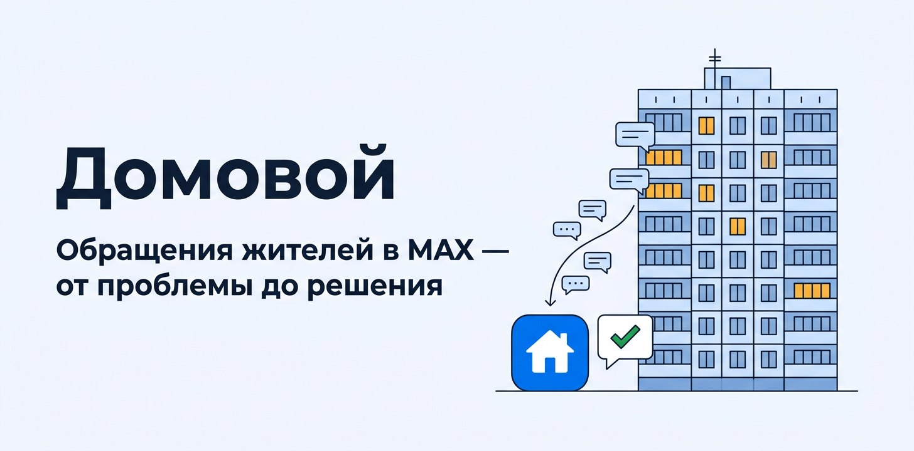
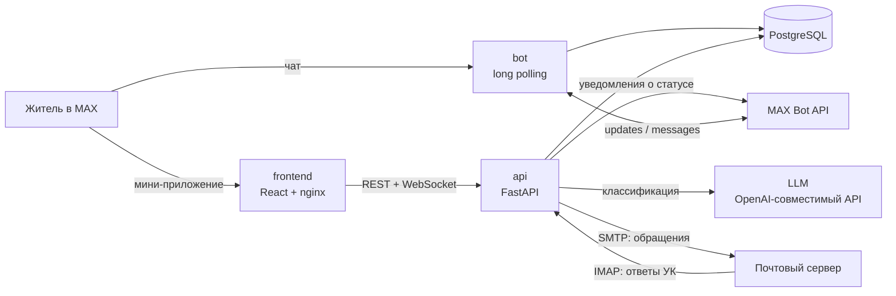

# Домовой

<p align="center"></p>

<p align="center">
  Бот и мини-приложение в MAX: житель описывает проблему с домом, а «Домовой» сам находит ответственного, регистрирует обращение и ведёт его до результата.
</p>

<p align="center">
  <a href="#быстрый-старт">Быстрый старт</a> •
  <a href="#сценарий-проверки">Сценарий проверки</a> •
  <a href="#архитектура">Архитектура</a> •
  <a href="backend/README.md">Backend</a> •
  <a href="frontend/README.md">Frontend</a> •
  <a href="design/README.md">Дизайн</a>
</p>

Жителю многоквартирного дома не нужно разбираться, кто отвечает за перегоревшую лампу в подъезде или течь в подвале. Он пишет обычным текстом. Языковая модель определяет тип проблемы, ответственную организацию, срочность и срок. Письмо уходит в управляющую компанию, а статус обращения житель видит в чате и получает уведомлением в боте.

Проект сделан на хакатоне MAX, трек «Умный город».

| | |
| --- | --- |
| Бот в MAX | <https://max.ru/t633_hakaton_max_bot> |
| Мини-приложение | <https://domovoy.stirkk.ru> (открывается внутри MAX) |
| API | <https://domovoy.stirkk.ru/api>, Swagger — [/api/docs](https://domovoy.stirkk.ru/api/docs) |
| Презентация | HTML-слайды 1920×1080 в [presentation/](presentation/) |

## Быстрый старт

Нужен Docker с Compose v2. Одна команда поднимает базу, тестовые данные, API, бота и фронтенд:

```bash
cp backend/.env.example backend/.env
# впишите в backend/.env значения GPT_TOKEN, MAX_TOKEN, MAIL_PASSWORD и ESIA_PASSWORD
docker compose up --build
```

Сборка с нуля занимает около минуты. Потом откройте:

- <http://localhost:3000> — мини-приложение от имени демо-жителя;
- <http://localhost:8000/docs> — Swagger API.

> [!IMPORTANT]
> Рабочие значения токенов, пароля почты и пароля входа через ЕСИА указаны на первом слайде презентации. В репозитории секретов нет. Токены в истории git тестовые и недействительные.

## Основной сценарий

1. Житель открывает бота в MAX и нажимает «Начать». Бот присылает приветствие и две кнопки: «Открыть Домового» и «Мои обращения».
2. Кнопка «Открыть Домового» запускает мини-приложение. При первом входе оно показывает демо-экран «Вход через ЕСИА». После ввода пароля житель зарегистрирован и привязан к дому, а аватар подтягивается из профиля MAX.
3. Житель видит общий чат своего дома, список своих обращений и сведения о доме с картой.
4. Нажимает «Новое обращение», выбирает тему, описывает проблему и при желании прикладывает фото.
5. LLM классифицирует текст. В чате обращения сразу появляется ответ «Домового»: тип проблемы, ответственный, срок и план действий.
6. Письмо с обращением и фото уходит в управляющую компанию.
7. УК отвечает на письмо. «Домовой» проверяет ящик раз в 10 секунд, LLM читает ответ и ставит статус: «Проверено» или «Дополните».
8. Житель видит новый статус в чате обращения и получает сообщение от бота.
9. Если УК просит подробности, житель дописывает их в тот же чат, и дополнение тоже уходит письмом.

Статусы: `in_progress` — «В работе», `dop` — «Дополните», `checked` — «Проверено», `close` — «Закрыто». «Закрыто» ставится только запросом к API, в интерфейсе такой кнопки нет. Кнопка «Мои обращения» в боте показывает все обращения, кроме закрытых.

## Архитектура



| Компонент | Что делает | Где |
| --- | --- | --- |
| `bot` | Отвечает на «Начать» приветствием и кнопкой запуска мини-приложения, по кнопке «Мои обращения» присылает список | [backend/src/umniy_dom_max/cmd/bot.py](backend/src/umniy_dom_max/cmd/bot.py) |
| `api` | REST и WebSocket для мини-приложения, вход через демо-ЕСИА, классификация через LLM, отправка писем, опрос почтового ящика | [backend/](backend/README.md) |
| `frontend` | Мини-приложение: вход, чат дома, обращения, форма нового обращения, сведения о доме | [frontend/](frontend/README.md) |
| `postgres` | Пользователи, дома, обращения, сообщения, вложения | образ `postgres:17-alpine` |
| `seed` | Одноразово заполняет пустую базу тестовыми данными и завершается | [backend/seed/data.json](backend/seed/data.json) |

Бот и API — два процесса одного Python-пакета. Они работают с одной базой напрямую, без HTTP между собой. Регистрирует жителей только API, бот лишь ведёт в мини-приложение.

## Окружение

### Порты

| Порт | Сервис |
| --- | --- |
| `3000` | мини-приложение (nginx) |
| `8000` | API, Swagger на `/docs` |
| `5432` | PostgreSQL, только внутри сети Compose |

### Переменные окружения

Файл `backend/.env` читают `api`, `bot` и `seed`. Шаблон лежит в [backend/.env.example](backend/.env.example).

| Переменная | Обязательна | Назначение |
| --- | --- | --- |
| `GPT_TOKEN` | да | ключ LLM; без него не стартуют ни API, ни бот |
| `MAX_TOKEN` | для бота | токен бота MAX; без него контейнер `bot` падает и перезапускается |
| `MAIL_PASSWORD` | для создания обращений | пароль ящика, с которого уходят письма в УК |
| `ESIA_PASSWORD` | для регистрации | пароль демо-экрана «Вход через ЕСИА»; без него новые жители не регистрируются |
| `MAIL_HOST`, `MAIL_USER` | нет | почтовый сервер и ящик, по умолчанию `mail.domovoy.stirkk.ru` |
| `MAIL_TO` | нет | адрес УК, куда уходят обращения |
| `UK_AUTOREPLY` | нет | демо: `true` — письма уходят в свой ящик, за УК через 5–10 с отвечает LLM |
| `GPT_BASE_URL`, `GPT_MODEL` | нет | адрес OpenAI-совместимого API и модель |
| `MAX_API_URL` | нет | по умолчанию `https://platform-api2.max.ru` |
| `DATABASE_URL` | нет | в Compose всегда указывает на контейнер `postgres` |
| `DEBUG` | нет | `true` включает Swagger и подробные ошибки 500, по умолчанию `true` |
| `ENABLE_CORS`, `HOST`, `PORT`, `ROOT_PATH`, `LOG_LEVEL` | нет | настройки HTTP-сервера |

Фронтенд настраивается аргументами сборки: `VITE_API_URL` — адрес API, `VITE_DEMO_USER_ID` и `VITE_DEMO_CHAT_ID` — пользователь и чат для запуска вне MAX. Compose задаёт `VITE_API_URL` и `VITE_DEMO_USER_ID`.

### Зависимости

| Часть | Стек | Версии зафиксированы в |
| --- | --- | --- |
| Backend | Python 3.14, FastAPI, SQLAlchemy (async) + asyncpg, Pydantic AI, uvicorn | [backend/uv.lock](backend/uv.lock) |
| Frontend | React 19, Redux Toolkit, React Router 7, Vite 8, Bun | [frontend/bun.lock](frontend/bun.lock) |

### Внешние сервисы

Эти сервисы нельзя поднять в Docker, проект обращается к ним по сети:

| Сервис | Зачем | Что нужно для проверки |
| --- | --- | --- |
| MAX Bot API | получать события бота и отправлять сообщения | `MAX_TOKEN` |
| LLM (`freellmapi.stirk1337.ru`, OpenAI-совместимый) | классифицировать обращения и ответы УК | `GPT_TOKEN` |
| Почтовый сервер `mail.domovoy.stirkk.ru` | SMTP 465 для писем в УК, IMAP 993 для ответов | `MAIL_PASSWORD` |

## Данные

Реальных интеграций с Госуслугами, реестрами домов и ГИС ЖКХ в MVP нет. Все данные тестовые:

- Вход через ЕСИА — демо-экран с одним общим паролем из `ESIA_PASSWORD`.
- При первом входе житель привязывается к двум **случайным** домам из базы.
- Адреса домов и демо-обращение смоделированы и лежат в [backend/seed/data.json](backend/seed/data.json).
- Письма уходят на один тестовый адрес УК из `MAIL_TO`.

Таблицы создаются при старте API. Фото из обращений сжимаются, хранятся в базе как base64-строки и прикладываются к письму.

### Тестовые данные

Контейнер `seed` заполняет базу, только если в ней ещё нет домов. Повторный запуск ничего не меняет.

| Что | Значение |
| --- | --- |
| Демо-житель | `id = 1`, «Демо-житель» |
| Его дома | «г. Казань, ул. Баумана, д. 10» (`id = 1`), «г. Казань, ул. Пушкина, д. 25» (`id = 2`) |
| Обращение | `id = 1`, «Не горит свет в подъезде», статус «В работе» |
| Ещё дома | три адреса без жителей, для регистрации новых пользователей |

Авторизации в API нет: пользователь определяется по `user_id` из MAX. Локально фронтенд работает от имени `id = 1`. Этот житель уже есть в базе, поэтому экран входа через ЕСИА локально не появляется.

## Сценарий проверки

После `docker compose up --build`:

1. Откройте <http://localhost:3000>. Вы увидите чат дома «ул. Баумана, д. 10» с сообщением из сида.
2. Напишите сообщение и отправьте. Оно появится в чате.
3. Откройте меню слева и выберите обращение № 1. Откроется его переписка с ответом «Домового».
4. Смените статус обращения. В продукте это происходит, когда УК отвечает на письмо, а для проверки хватит запроса:

   ```bash
   curl -X PATCH localhost:8000/appeals/1/update \
     -H 'Content-Type: application/json' \
     -d '{"status": "checked", "mail_text": "Лампу заменили"}'
   ```

   Статус в мини-приложении обновится без перезагрузки: изменения приходят по WebSocket.

5. В меню нажмите «Новое обращение», выберите тему, опишите проблему, например «В подвале течёт труба», и нажмите «Создать обращение». Для этого нужны `GPT_TOKEN` и `MAIL_PASSWORD`.

Сценарий в MAX: откройте бота и нажмите «Начать», затем «Открыть Домового». Новый житель сначала увидит экран «Вход через ЕСИА».

### Ожидаемое поведение

| Действие | Результат |
| --- | --- |
| `GET /users/1/houses` | `200`, два дома демо-жителя |
| `GET /users/999` | `404`, `{"detail": "Not found"}` |
| `POST /users/demo` для нового жителя с неверным паролем | `401`, `{"detail": "Неверный пароль"}` |
| `POST /users/demo` для нового жителя с паролем из `ESIA_PASSWORD` | `200`, житель с двумя случайными домами |
| `POST /appeals/create` с текстом о проблеме в доме | `200`, обращение с классификацией и двумя сообщениями: жителя и бота |
| `POST /appeals/create` с текстом не о доме | `403`, `{"detail": "Appeal is bad"}` |
| `POST /appeals/create` с чужим `house_id` | `403`, `{"detail": "Address not linked to user"}` |
| сообщение в закрытое обращение | сообщение сохраняется, бот отвечает «Данное обращение уже закрыто» |
| «Начать» в боте | приветствие и кнопки «Открыть Домового» и «Мои обращения» |

## Проверка API

API описан в [openapi.json](openapi.json) (OpenAPI 3.1). Обязательные проверки с параметрами, ролями, кодами ответа и обязательными полями лежат в [DATA-API.yaml](DATA-API.yaml).

Проверки рассчитаны на прод `https://domovoy.stirkk.ru/api`. Тестовый житель там — `user_id = 1` с домом `house_id = 3` и обращением `appeal_id = 3`. Авторизации нет, поэтому логины и пароли не нужны.

## Остановка и перезапуск

```bash
docker compose down        # остановить, данные сохранятся
docker compose up -d       # запустить снова в фоне
docker compose down -v     # остановить и удалить базу; сид отработает заново при следующем запуске
```

## Известные ограничения

- Нет авторизации: API доверяет `user_id`, который присылает клиент.
- Вход через ЕСИА — демо: один общий пароль, настоящей интеграции с Госуслугами нет.
- Дома назначаются случайно, интеграции с реестром жильцов нет.
- Письма УК уходят на один фиксированный адрес.
- Статус «Закрыто» ставится только запросом к API.
- Без `MAIL_PASSWORD` создание обращения завершается ошибкой `500`: письмо отправляется до сохранения.
- Один `MAX_TOKEN` — один бот. Локальный бот с продовым токеном отнимет события у продового.
- WebSocket-комнаты хранятся в памяти одного процесса API, поэтому горизонтально масштабировать API нельзя.
