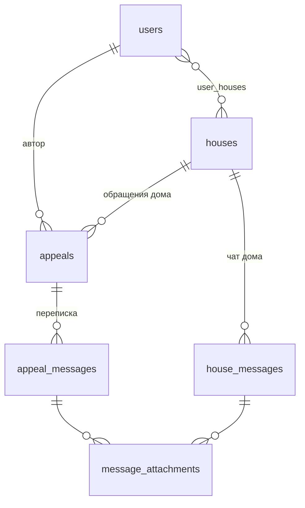

# Домовой — backend

<p align="center"></p>

API мини-приложения и бот MAX в одном Python-пакете. API регистрирует жителей через демо-вход ЕСИА, принимает обращения, классифицирует их через LLM, отправляет письма в управляющую компанию и рассылает обновления по WebSocket. Бот открывает мини-приложение и показывает обращения жителя прямо в чате.

Общее описание проекта и запуск всех компонентов разом описаны в [корневом README](../README.md).

## Быстрый старт

Нужны [uv](https://docs.astral.sh/uv/), PostgreSQL и libmagic (`brew install libmagic`). Проще всего поднять базу из корневого Compose:

```bash
cp .env.example .env          # впишите GPT_TOKEN, MAX_TOKEN, MAIL_PASSWORD и DATABASE_URL
uv sync
uv run seed seed/data.json    # тестовые дома, демо-житель и обращение
uv run api                    # http://localhost:8000/docs
```

Бот запускается отдельным процессом, ему нужны `MAX_TOKEN` и `GPT_TOKEN`:

```bash
uv run bot
```

## Команды

Команды объявлены в `[project.scripts]` файла [pyproject.toml](pyproject.toml). В Docker они же служат `command` контейнера.

| Команда | Что делает |
| --- | --- |
| `api` | FastAPI на `HOST:PORT`, при старте создаёт таблицы и запускает опрос почтового ящика |
| `bot` | long polling MAX Bot API: на `bot_started` — приветствие с кнопкой «Открыть Домового», по кнопке «Мои обращения» — список незакрытых обращений |
| `seed [путь]` | заполняет базу из JSON, только если в ней нет домов; по умолчанию `/seed/data.json` |

## Устройство

```text
src/umniy_dom_max/
  cmd/              — точки входа: api, bot, seed
  attachments.py    — проверка и сжатие фото
  db/
    models.py       — SQLAlchemy-модели
    repository.py   — все запросы к базе
    database.py     — движок, сессии, создание таблиц
  handlers.py       — REST- и WebSocket-эндпоинты
  schemas.py        — Pydantic-схемы запросов и ответов
  llm.py, prompts.py — агенты Pydantic AI: классификация обращения, ответа УК и демо-ответ за УК
  mail.py           — отправка по SMTP и чтение по IMAP
  mail_monitoring.py — фоновая задача: раз в 10 секунд читает ответы УК
  html.py           — HTML-шаблоны писем
  ws.py             — комнаты WebSocket в памяти процесса
  settings.py       — настройки из переменных окружения
```

Обработчики не ходят в базу сами, только через `repository`. Зависимости (сессия, LLM-агенты, настройки, менеджер WebSocket) подключаются через `Depends` из [dependencies.py](src/umniy_dom_max/dependencies.py).

## Классификация обращений

Текст обращения уходит агенту `appeal_classifier`. Он возвращает структурированный ответ:

| Поле | Значения |
| --- | --- |
| `result` | `OK` — это обращение, `N` — нет |
| `title` | короткое название из 2–4 слов, например «Не работает лифт» |
| `problem_type` | освещение подъезда, ЖКХ, дороги, мусор, благоустройство, водоснабжение, отопление, лифт, другая |
| `urgency` | низкий, средний, высокий, критичный |
| `responsible_org` | управляющая компания, администрация города, водоканал, электросети, дорожная служба, региональный оператор ТКО, другая |
| `deadline_days`, `deadline_text` | срок в днях и его текстовое описание |
| `action_plan` | что сделает исполнитель |

Если модель вернула `result = N`, обращение не создаётся и API отвечает `403`. Дополнения к обращению LLM сейчас не проверяет: проверка в [handlers.py](src/umniy_dom_max/handlers.py) закомментирована, и каждое дополнение уходит письмом в УК.

Второй агент читает ответы УК из почты и решает, какой статус поставить: `dop` или `checked`. Письмо не про статус он помечает `N`, и оно пропускается. Обращение находится по теме письма.

Третий агент работает только при `UK_AUTOREPLY=true`. Он отвечает на письмо с обращением от имени УК через 5–10 секунд, чтобы демо прошло без живой управляющей компании. Статус `close` ни один агент не ставит: его задают запросом `PATCH /appeals/{appeal_id}/update`.

## API

Полное описание со схемами открывается в Swagger на `/docs`, если `DEBUG=true`.

| Метод и путь | Что делает |
| --- | --- |
| `POST /users/demo` | вход через демо-ЕСИА: вернуть жителя и обновить аватар или зарегистрировать нового со случайными домами, если пароль совпал с `ESIA_PASSWORD`, иначе `401` |
| `GET /users/{user_id}` | профиль, дома и обращения |
| `GET /users/{user_id}/houses` | дома пользователя |
| `GET /users/{user_id}/appeals` | обращения пользователя с сообщениями |
| `GET /users/{user_id}/appeals/short` | обращения без сообщений |
| `POST /appeals/create` | создать обращение: LLM, письмо, запись в базу |
| `PATCH /appeals/{appeal_id}/update` | сменить статус и уведомить жителя в MAX |
| `GET /appeals/{appeal_id}/messages` | обращение с перепиской |
| `POST /appeals/{appeal_id}/message` | дополнить обращение |
| `GET /houses` | все дома |
| `POST /houses` | добавить дом |
| `GET /houses/{house_id}/messages` | общий чат дома |
| `POST /houses/{house_id}/message` | написать в чат дома |
| `GET /houses/{house_id}/appeals` | обращения по дому |

Вложения — только фото, приходят data URL в поле `attachments`. Формат определяется по содержимому (python-magic): jpeg, png, webp, heic/heif, bmp, tiff, остальное (PDF, документы, архивы, gif, svg) отклоняется с 415. Каждое фото всегда сжимается ([attachments.py](src/umniy_dom_max/attachments.py)): до 1200 px по длинной стороне, JPEG q45. Больше 10 МБ после сжатия — 413.

WebSocket: `/ws/houses/{house_id}?user_id=…` и `/ws/appeals/{appeal_id}?user_id=…`. Сервер присылает события `message`, `read`, `appeal_created` и `appeal_updated`. Клиент отправляет `{"type": "read", "message_ids": [...]}`, чтобы отметить сообщения прочитанными.

## Модель данных



Пользователь с `id = 0` — это бот. Он создаётся при старте API, и от его имени пишутся системные сообщения. У жителя хранится `avatar_url` из профиля MAX, у обращения — короткое название `title` от LLM.

## Переменные окружения

Все настройки перечислены в [settings.py](src/umniy_dom_max/settings.py), шаблон лежит в [.env.example](.env.example). Таблица с описанием есть в [корневом README](../README.md#переменные-окружения).

## Docker

[Dockerfile](Dockerfile) собирает образ в два этапа: `uv sync --locked` в builder, затем только `.venv` и исходники в runtime. По умолчанию запускается `api`, другой процесс выбирается через `command`: `bot`, `seed`.

В образе `ROOT_PATH=/api`, потому что на проде API стоит за nginx под префиксом `/api`. Корневой Compose сбрасывает его в пустую строку.
